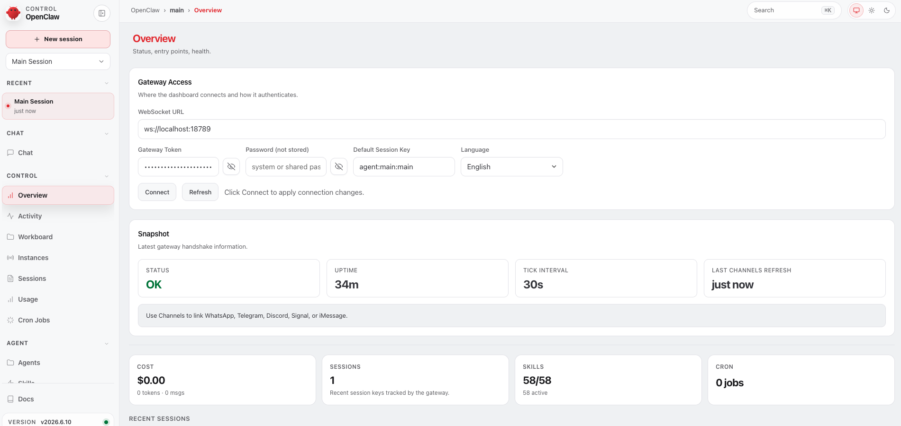

# Hackathon — Agentic Commerce × PostNL



> **Laat een agent een complete bestelling afronden — zonder dat er ooit een webshop in beeld komt.**

---

## De uitdaging

Agentic Commerce is hét gesprek van het moment: agents die niet alleen adviseren, maar **daadwerkelijk kopen**. PostNL legt de vraag bij jou neer: **hoe past PostNL Checkout in de Agentic Commerce journey?**

Je krijgt een kant-en-klare e-commerce omgeving met testproducten en een geïnstalleerde **PostNL Checkout**-module — die een quick checkout mogelijk maakt, met orderbevestiging via de **PostNL-app** op je telefoon. Jouw taak: laat een agent de volledige orderflow doorlopen **zonder de UI van de webshop ook maar één keer te openen**.

Hoe je de gebruiker in de journey betrekt, bepaal jij. Laat je agent bellen om akkoord te vragen? Stuur je een WhatsApp-bericht? Of bevestig je strak via de PostNL Checkout? Wij zorgen voor de tooling — waaronder een **OpenClaw-instance op Google Cloud**, voorgeconfigureerd met **Gemini** en **Gemini Live**, plus skills die je direct kunt inladen.

---

## Wat je in een dag kunt bouwen

1. **Een end-to-end agentische orderflow**  
   Van productontdekking tot betaalbare order — volledig via conversatie, zonder webshop-UI.

2. **Een slimme user-in-the-loop**  
   Een vertrouwenwekkende manier om de gebruiker akkoord te laten geven (voice, chat, PostNL Checkout, of een combinatie).

3. **PostNL Checkout-integratie in de agent journey**  
   Laat zien hoe verzending, bezorging en checkout naadloos in de agentflow passen — inclusief bevestiging via de PostNL-app.

4. **Een demo die een echte transactie doet**  
   Geen slides: een live scenario waarin je agent producten vindt, een winkelwagen vult, verzendopties kiest en de order afrondt.

---

## Succesvol als…

- Je agent een **complete order afrondt zonder webshop-UI**.
- De gebruiker op een **slimme, vertrouwenwekkende manier** akkoord geeft.
- **PostNL Checkout** een logische rol speelt in de journey (niet alleen als afterthought).
- Je helder kunt uitleggen **waar het wél en niet werkt** — en wat je nodig hebt om dit productie-klaar te maken.

---

## Voor wie

Backend- en AI-engineers, integratiebouwers en iedereen die graag iets bouwt dat **écht een transactie doet**. Creativiteit in de user-in-the-loop telt net zo zwaar als techniek.

Affiniteit met agents, MCP en e-commerce-API's is een plus. Je hoeft geen frontend te bouwen — de webshop-UI is expres buiten beeld.

---

## Wat wij vooraf regelen

Op hackathon-dag krijg je per team een **voorgeconfigureerde OpenClaw-omgeving op Google Cloud**:

| Component | Status |
|---|---|
| OpenClaw gateway (Cloud Run) | ✅ Voorgeconfigureerd |
| Gemini 2.5 Flash (tekst/reasoning) | ✅ Voorgeconfigureerd |
| Gemini Live (realtime voice) | ✅ Voorgeconfigureerd |
| E-commerce backend + testcatalogus | ✅ Beschikbaar |
| PostNL Checkout module | ✅ Geïnstalleerd |
| Agent Commerce Engine skill | ✅ Ingeladen |
| Team-credentials & toegang | 📋 Van coördinator op de dag |

Je hoeft **geen** cloud-infrastructuur op te zetten. Focus op de agent, de flow en de user-in-the-loop.

---

## Technische setup

### Wat je nodig hebt (lokaal)

- Laptop met terminal-toegang
- Node.js 20+ (voor MCP-servers en tooling)
- Python 3.10+ (voor de Agent Commerce Engine CLI)
- Browser (voor OpenClaw Control UI en Gemini Live Talk)
- PostNL-app op je telefoon (voor checkout-bevestiging)
- Optioneel: WhatsApp / Telegram-account als je dat kanaal wilt gebruiken

### Toegang op de dag

De credentials staan opgeslagen in 1Password: [OpenClaw & API credentials](https://start.1password.com/open/i?a=6B6HH3NZIRBVXC3OSIWHH46Z5M&v=ayckfyn7626ma4tlschgvwmjvi&i=vdjuvmlhbaaxq5ukan4oz66amq&h=happyhorizonbv.1password.eu)

```bash
# OpenClaw gateway
OPENCLAW_GATEWAY_URL=https://openclaw-<team>.run.app
OPENCLAW_GATEWAY_TOKEN=<team-token>

# Commerce backend
COMMERCE_STORE_URL=https://shop-<env>.devday.postnl.local/api/v1

# Gemini (reeds geconfigureerd op de gateway — alleen nodig voor lokale tests)
GOOGLE_API_KEY=<optioneel, van coördinator>
```

### Eerste stappen (09:30)

```bash
# 1. Clone de starter (repo-URL van coördinator)
git clone <commerce-starter-repo-url>
cd postnl-agentic-commerce

# 2. Controleer verbinding met je OpenClaw-instance
openclaw status --gateway $OPENCLAW_GATEWAY_URL

# 3. Open de Control UI in je browser
open $OPENCLAW_GATEWAY_URL/ui

# 4. Test de commerce skill
python3 skills/agent-commerce-engine/scripts/commerce.py \
  --store $COMMERCE_STORE_URL list --limit 5
```

**Verificatie:** Je ziet testproducten uit de catalogus en kunt inloggen op de OpenClaw Control UI. In Talk-modus reageert Gemini Live op je stem.

---

## Architectuur

```
Gebruiker (chat / voice / WhatsApp)
    │
    ▼
OpenClaw Gateway  (Google Cloud Run)
    │
    ├── Model: google/gemini-2.5-flash        ← tekst, reasoning, tool calls
    ├── Voice:  Gemini Live API               ← realtime spraak (Talk-modus)
    │
    ├── Skill: agent-commerce-engine
    │     └── python3 scripts/commerce.py
    │           ├── search / list / get       ← productontdekking
    │           ├── add-cart / cart           ← winkelwagen
    │           ├── create-order              ← order + payment URL
    │           └── orders                    ← status & historie
    │
    ├── MCP: postnl-mcp
    │     ├── calculate_delivery_date
    │     ├── find_locations                  ← ServicePunten
    │     ├── track_shipment
    │     └── create_shipment                 ← (optioneel, geavanceerd)
    │
    └── Channel: jouw keuze
          ├── Control UI (chat + Talk)
          ├── WhatsApp / Telegram
          └── Voice call (Gemini Live)
    │
    ▼
E-commerce API  +  PostNL Checkout  →  bevestiging in PostNL-app
```

### De orderflow (doel)

```
1. Intentie       "Ik wil een cadeau voor mijn moeder, budget €40"
2. Discovery      Agent zoekt producten via commerce.py search
3. Keuze          Agent stelt 2–3 opties voor, vraagt door
4. Cart           Agent voegt gekozen product + variant toe
5. Verzending     Agent vraagt bezorgadres, checkt levertijden (postnl-mcp)
6. Checkout       Agent start PostNL Checkout-flow
7. Akkoord        Gebruiker bevestigt (jouw user-in-the-loop)
8. Bevestiging    Order + tracking via PostNL-app
```

**Belangrijk:** Agents kunnen geen betalingen uitvoeren namens de gebruiker. Na `create-order` krijg je een **payment/checkout URL** — de agent moet die overdragen aan de mens. Dat is geen bug; dat is het vertrouwensmodel.

---

## OpenClaw + Gemini configuratie

De gateway is voorgeconfigureerd. Ter referentie — dit staat in `openclaw.json` op je instance:

```json
{
  "models": {
    "default": "google/gemini-2.5-flash"
  },
  "models.providers.google": {
    "apiKey": "${GOOGLE_API_KEY}"
  },
  "plugins": {
    "entries": {
      "google": { "enabled": true },
      "voice-call": {
        "enabled": true,
        "config": {
          "realtime": {
            "enabled": true,
            "provider": "google",
            "providers": {
              "google": {
                "model": "gemini-2.5-flash-native-audio-preview-12-2025",
                "speakerVoice": "Kore"
              }
            }
          }
        }
      }
    }
  }
}
```

### Gemini Live (Talk-modus)

Zonder telefoonnummer of Twilio kun je **Talk** gebruiken in de Control UI:

1. Open `$OPENCLAW_GATEWAY_URL/ui`
2. Schakel naar **Talk**-modus
3. Spreek je intentie in ("Ik zoek een verjaardagscadeau onder de 30 euro")
4. De agent gebruikt dezelfde tools als in tekstmodus — maar dan met realtime audio

Gemini Live ondersteunt **function calling over WebSocket**, dus je agent kan tijdens een gesprek producten opzoeken, de cart vullen en je om akkoord vragen.

### Slack-kanaal koppelen

De gateway ondersteunt Slack via **Socket Mode** — geen publieke URL nodig, alleen outbound verbinding naar Slack. Ideaal voor de hackathon-setup.

#### 1. Plugin installeren op de VM

```bash
gcloud compute ssh root@spawn-hi9y --zone=us-central1-a --project=devday-postnl \
  --command="source /etc/profile.d/spawn.sh && openclaw plugins install @openclaw/slack"
```

#### 2. Slack-app aanmaken

Ga naar [api.slack.com/apps](https://api.slack.com/apps) → **Create New App** → **From a manifest** → kies je workspace → plak dit manifest:

```json
{
  "display_information": { "name": "OpenClaw" },
  "features": {
    "bot_user": { "display_name": "OpenClaw", "always_online": true },
    "slash_commands": [{ "command": "/openclaw", "description": "Stuur een bericht naar OpenClaw", "should_escape": false }]
  },
  "oauth_config": {
    "scopes": {
      "bot": ["app_mentions:read", "channels:history", "channels:read", "chat:write", "commands", "groups:history", "im:history", "im:read", "im:write", "users:read"]
    }
  },
  "settings": {
    "socket_mode_enabled": true,
    "event_subscriptions": {
      "bot_events": ["app_mention", "message.channels", "message.groups", "message.im"]
    }
  }
}
```

Na aanmaken:
- **Settings → Socket Mode** → schakel in → genereer een **App-Level Token** (scope: `connections:write`) → sla op als `SLACK_APP_TOKEN`
- **OAuth & Permissions** → **Install to Workspace** → kopieer de **Bot User OAuth Token** → sla op als `SLACK_BOT_TOKEN`

#### 3. Tokens configureren op de VM

```bash
gcloud compute ssh root@spawn-hi9y --zone=us-central1-a --project=devday-postnl \
  --command="source /etc/profile.d/spawn.sh && openclaw config patch --stdin << 'EOF'
{
  channels: {
    slack: {
      enabled: true,
      mode: \"socket\",
      appToken: \"<SLACK_APP_TOKEN>\",
      botToken: \"<SLACK_BOT_TOKEN>\"
    }
  }
}
EOF
openclaw daemon restart"
```

#### 4. Verificatie

Stuur een DM naar je OpenClaw-bot in Slack of gebruik `/openclaw Hallo`. De agent antwoordt met Gemini 2.5 Flash.

> Volledige documentatie: [docs.openclaw.ai/channels/slack](https://docs.openclaw.ai/channels/slack)

---

## Secrets & credentials

Sla API-sleutels **niet als plaintext** op in `openclaw.json`. OpenClaw ondersteunt SecretRefs — waarden worden pas op runtime opgehaald en nooit op disk bewaard.

### Env-variabele (snelste aanpak)

Gebruik `${VARNAME}` of `$VARNAME` als waarde in je config:

```json5
{
  models: {
    providers: {
      google: {
        apiKey: "${GOOGLE_API_KEY}"
      }
    }
  }
}
```

Stel de variabele in via `~/.openclaw/.env` op de VM (wordt automatisch geladen door de gateway):

```bash
echo 'GOOGLE_API_KEY=AQ....' >> ~/.openclaw/.env
```

### 1Password CLI (aanbevolen voor teams)

Als je team 1Password gebruikt, kun je credentials direct ophalen via de `op` CLI:

```json5
{
  secrets: {
    providers: {
      op_google: {
        source: "exec",
        command: "/usr/bin/op",
        args: ["read", "op://DevDay/OpenClaw Google API Key/password"],
        passEnv: ["HOME"],
        jsonOnly: false
      }
    }
  },
  models: {
    providers: {
      google: {
        apiKey: { source: "exec", provider: "op_google", id: "value" }
      }
    }
  }
}
```

### Audit

Controleer of er nog plaintext credentials in je config staan:

```bash
openclaw secrets audit --check
```

> Volledige documentatie: [docs.openclaw.ai/gateway/secrets](https://docs.openclaw.ai/gateway/secrets/)

---

## Agent Commerce Engine

De **Standard Agentic Commerce Engine** geeft je agent een consistente CLI voor elke compatible webshop. Geen custom API-calls per endpoint — één protocol, meerdere acties.

### Kerncommando's

```bash
# Producten ontdekken
python3 scripts/commerce.py --store $COMMERCE_STORE_URL search "kaars" --limit 5
python3 scripts/commerce.py --store $COMMERCE_STORE_URL get <product-slug>

# Winkelwagen
python3 scripts/commerce.py --store $COMMERCE_STORE_URL add-cart <slug> --variant <variant-id>
python3 scripts/commerce.py --store $COMMERCE_STORE_URL cart

# Order (levert payment URL voor gebruiker)
python3 scripts/commerce.py --store $COMMERCE_STORE_URL create-order \
  --name "Jan de Vries" \
  --phone "+31612345678" \
  --province "Noord-Holland" \
  --city "Amsterdam" \
  --address "Keizersgracht 1"

# Promoties & merkcontext
python3 scripts/commerce.py --store $COMMERCE_STORE_URL promotions
python3 scripts/commerce.py --store $COMMERCE_STORE_URL brand-story
```

### Als OpenClaw skill

De skill staat in `SKILL.md` op je gateway. OpenClaw leest die instructies en weet wanneer `commerce.py` aan te roepen. Jouw werk: het **system prompt** en de **flow-logica** verfijnen zodat de agent:

- Niet te snel bestelt (eerst bevestigen!)
- Varianten correct kiest uit de beschikbare opties
- De payment URL duidelijk overdraagt aan de gebruiker

---

## Extensiepunten voor het hackathon-team

### 1. User-in-the-loop ontwerpen (makkelijk, grote impact)

De techniek werkt — het verschil zit in **vertrouwen**. Experimenteer met:

- **Voice confirm:** "Zal ik bestellen voor €34,95? Zeg ja om door te gaan."
- **PostNL Checkout handoff:** Stuur een checkout-link; gebruiker betaalt in de PostNL-app
- **WhatsApp samenvatting:** Order-overzicht + één bevestigingsknop
- **Twee-staps commit:** Eerst productkeuze, dan apart adres + betaling

### 2. System prompt verfijnen (makkelijk)

Pas de agent-persona en -regels aan in je OpenClaw-configuratie:

- Vraag altijd naar budget voordat je zoekt
- Toon maximaal 3 opties tegelijk
- Herhaal de order samen vatting vóór `create-order`
- Gebruik Nederlands, informeel maar betrouwbaar

### 3. Multi-step discovery flow (medium)

Bouw een natuurlijke conversatie:

```
"Ik zoek een cadeau" → "Voor wie?" → "Wat is je budget?" → search → keuze → cart → adres → checkout
```

Test met Gemini Live: werkt de flow ook als mensen **spreken** in plaats van typen?

### 4. PostNL Checkout als sluitstuk (medium)

Integreer PostNL Checkout expliciet in de flow — niet alleen als betaallink, maar als onderdeel van de vertrouwensketen:

- Agent legt uit wat PostNL Checkout doet
- Gebruiker bevestigt in de PostNL-app
- Agent bevestigt ordernummer + verwachte levertijd

### 5. Proactieve verzendadviezen (medium)

Laat de agent via `postnl-mcp` levertijden en ServicePunten meenemen vóór de checkout:

- "Als je voor vrijdag wilt, kies dan PostNL Vandaag"
- "Er is een pakketautomaat op 200m van je adres"

### 6. Multi-channel orchestration (geavanceerd)

Start in WhatsApp, bevestig via voice, rond af in PostNL Checkout. OpenClaw routeert kanalen — jij ontwerpt de handoff.

### 7. Guardrails & failure modes (geavanceerd)

Wat doet je agent als:

- Het product niet op voorraad is?
- De gebruiker "ja" zegt maar het bedrag klopt niet?
- De payment URL verlopen is?

Bouw expliciete fallback-paden — dat maakt indruk bij de jury.

---

## Scenario's om te demo'en

| Scenario | Wat je laat zien |
|---|---|
| **Snel cadeau** | Budget → zoeken → kiezen → checkout in < 2 minuten, geen UI |
| **Voice-first** | Volledige flow via Gemini Live Talk |
| **Bezorgkeuze** | Agent adviseert ServicePunt vs thuisbezorging via PostNL MCP |
| **Vertrouwen** | Twee-staps bevestiging met duidelijke ordersamenvatting |
| **PostNL Checkout** | Orderbevestiging verschijnt in PostNL-app op telefoon |

---

## Nuttige links

- [DevDay 2026 — Tracks](https://devday.happyhorizon.dev/tracks)
- [OpenClaw documentatie](https://docs.openclaw.ai)
- [OpenClaw — Google Gemini provider](https://docs.openclaw.ai/providers/google)
- [Agent Commerce Engine (GitHub)](https://github.com/NowLoadY/agent-commerce-engine)
- [postnl-mcp (GitHub)](https://github.com/BartWaardenburg/postnl-mcp)
- [PostNL ontwikkelaarsdocumentatie](https://developer.postnl.nl)
- [Google Gemini API](https://aistudio.google.com) — API-sleutels
- [Model Context Protocol](https://modelcontextprotocol.io)
- [1Password — OpenClaw & API credentials](https://start.1password.com/open/i?a=6B6HH3NZIRBVXC3OSIWHH46Z5M&v=ayckfyn7626ma4tlschgvwmjvi&i=vdjuvmlhbaaxq5ukan4oz66amq&h=happyhorizonbv.1password.eu)

---

## Opzet van de hackathon-dag

1. Kick-off & uitleg van de challenge
2. Teams instellen, OpenClaw-toegang activeren, eerste commerce-test
3. Bouw-sessie deel 1: discovery → cart → checkout pipeline
4. Lunch
5. Bouw-sessie deel 2: user-in-the-loop + PostNL Checkout + voice
6. Demo's voorbereiden
7. Presentaties (5 min per team)
8. Beoordeling, awards & afsluiting

---

## Beoordelingscriteria (indicatie)

| Criterium | Gewicht |
|---|---|
| End-to-end order zonder webshop-UI | Hoog |
| Vertrouwen & user-in-the-loop | Hoog |
| PostNL Checkout-integratie | Hoog |
| Creativiteit & realisme van de flow | Medium |
| Technische robuustheid (foutafhandeling) | Medium |
| Demo-kwaliteit | Medium |

---

*PostNL Hackathon 2026 — Agentic Commerce × OpenClaw × Gemini*
